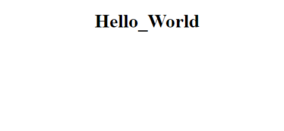
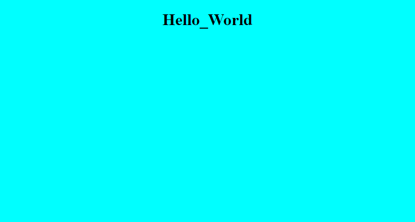
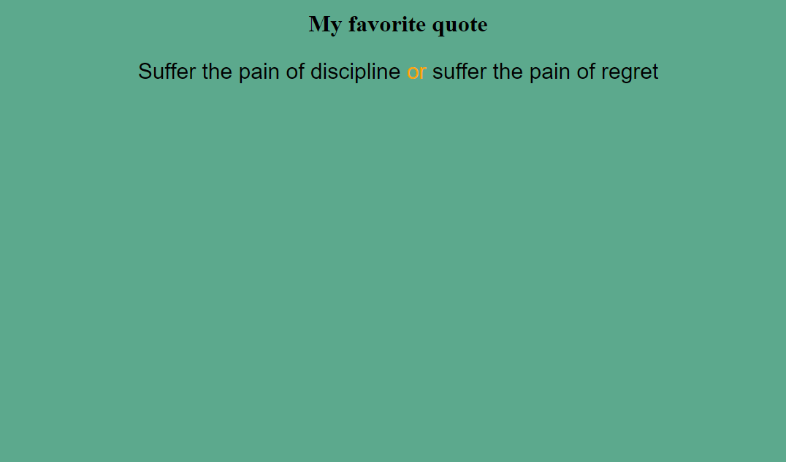
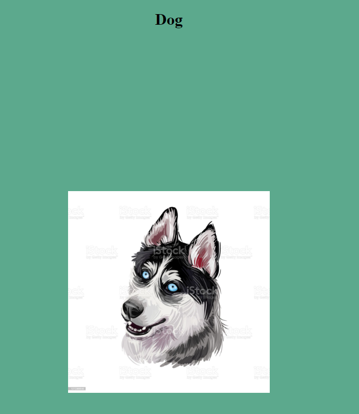
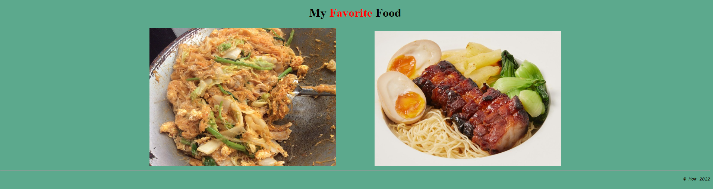

# Website

แบบฝึกหัดพื้นฐานการสร้าง Website

[***css_game*** (should play)](https://flexboxfroggy.com/)
## EXERCISE : 00

* Create file `hello_html_css.html`.
* Document name should be `hello_html_css.html`.
* Display "Hello_World" in title - bigger - and centered. 
* Open your file in your browser. You should see:

  

## EXERCISE : 01

* Same file but now change background colour to your favorite colour.
* Open your file in your browser. You should see :

  

## EXERCISE : 02

* Create file `Quote`
* Display "My favorite quote" in title - bigger - and centered. 
* Background colour should not be white.
* Display your quote on screen , and the middle sentence should be orange.
* Your quote font family should not be default ,font size should be 30px and text align center.
* Open your file in your browser. You should see :

  

## EXERCISE : 03

* Create file `Dog`.
* Go search for one dog image on Google.
* Display "Dog" in title - bigger - and centered. 
* Display your images after the previous text.
* "Dog" and image should be 500px distance apart 
* Dog image must clickable and navigate to [https://www.youtube.com/watch?v=AbszNcn0NFo&ab_channel=AnimalHouseforReal](https://www.youtube.com/watch?v=AbszNcn0NFo&ab_channel=AnimalHouseforReal) and align center.
* Don't use white background.
* Open your file in your browser. You should see :

  

## EXERCISE : 04

* Create file `my_favorite_food`.
* Display "My Favorite Food" in title - bigger - and centered, word "Favorite" should be red. 
* Go search for two images on Google.
* Display your images after the previous text.
* Each image size should be 500px and seperate from each other 100px.
* Background colour must be green.
* Both image must be clickable and navigate to cookery website.
* Under that, a horizontal line that separates the page (no matter the size of the
window).
* Finally, under this line, aligned on the right side of the page, in italic and with a
monospace font, the copyright symbol, your login, and the current year. (“© Mok 2022”)
* Open your file in your browser. You should see :

  

## !! Submission and evaluation

*  In the `meraki_code_camp` folder at the root of your home,create a new `Web00` folder and navigate to it.
* From now on, all exercise shoulde be in the correct folder rendering. Exercise 00 in the `ex00` folder, Exercise 01 in the `ex01` folder, etc .. you get the logic.
* Your exercise must upload to github.
