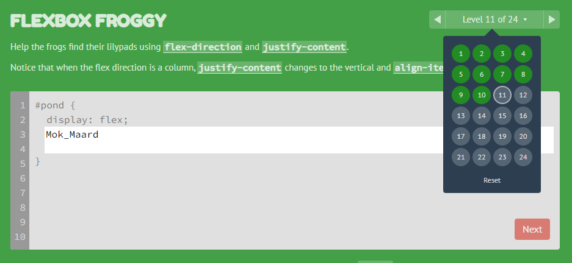
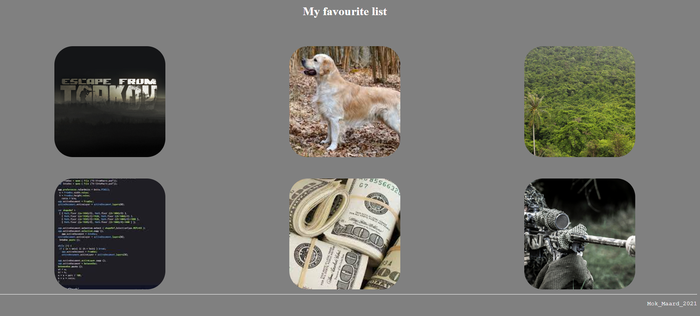
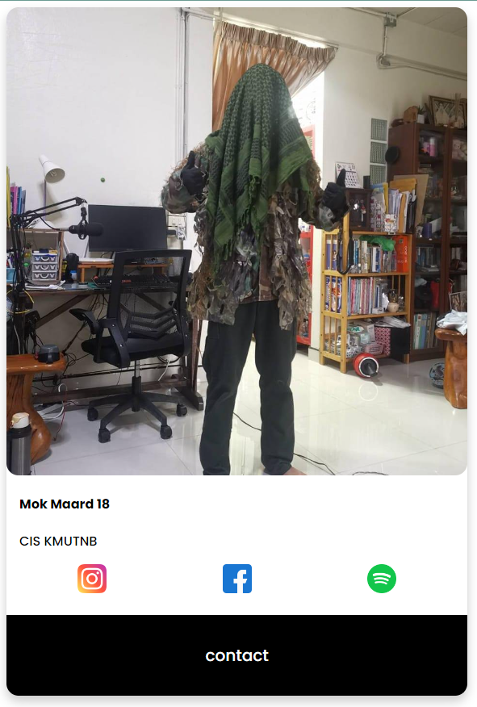
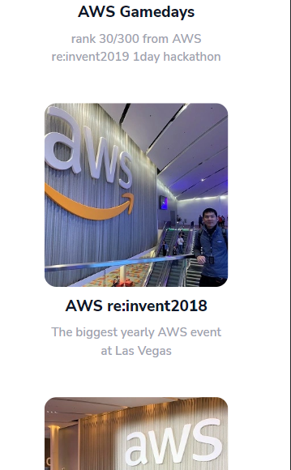

# Website

แบบฝึกหัดพื้นฐานการสร้าง Website

## EXERCISE : 00

* Play this game at least 10 levels. [***css_game***](https://flexboxfroggy.com/)
* Type your name ,screenshot and paste in ex00 folder.

  

## EXERCISE : 01

* From ex04 in web00, seperate css code from html file (``no css in html file``) and css file name is `uptou.css`.

## EXERCISE : 02

* Create file `my_favourite_list.html`
* Display `"My favourite list"` in title - bigger - and centered. 
* Background colour should not be white.
* Now create  3 * 2 images gallery that show your favourite things.
* All image must be clickable and navigate to something that related to image, last thing image must not be in square shape and image size is 300 * 300 px.
* Under that, a horizontal line that separates the page (no matter the size of the
window).
* Finally, under this line, aligned on the right side of the page, the copyright symbol, your name, and the current year. (“© Mok 2022”)
* No css style in html file, css file name `something_idk.css`.
* Open your file in your browser. You should see :

  

## EXERCISE : 03

* Create file `Card.html`.
* Create card that is you profile. 
* Text must be align left.
* Link or social icon align center that clickable and navigate to social media. 
* No css style in html file, css file name `im_the_best.css`.
* Card must have shadow and not be square.
* last one,Contact button on the bottom of the card , when mouse over background color change to grey and when you click it navigate to Facebook profile.
* Open your file in your browser. You should see :

  

## EXERCISE : 04

* From ex02 make website responsive with tailwind library. 
* Under each picture must have text that related to your image and align center. 

=======
* When you use mobile, picture and text must show in 1 column.
* For example:

  

## !! Submission and evaluation

*  In the `meraki_code_camp` folder at the root of your home,create a new `Web01` folder and navigate to it.
* From now on, all exercise shoulde be in the correct folder rendering. Exercise 00 in the `ex00` folder, Exercise 01 in the `ex01` folder, etc .. you get the logic.
* Your exercise must upload to github.
